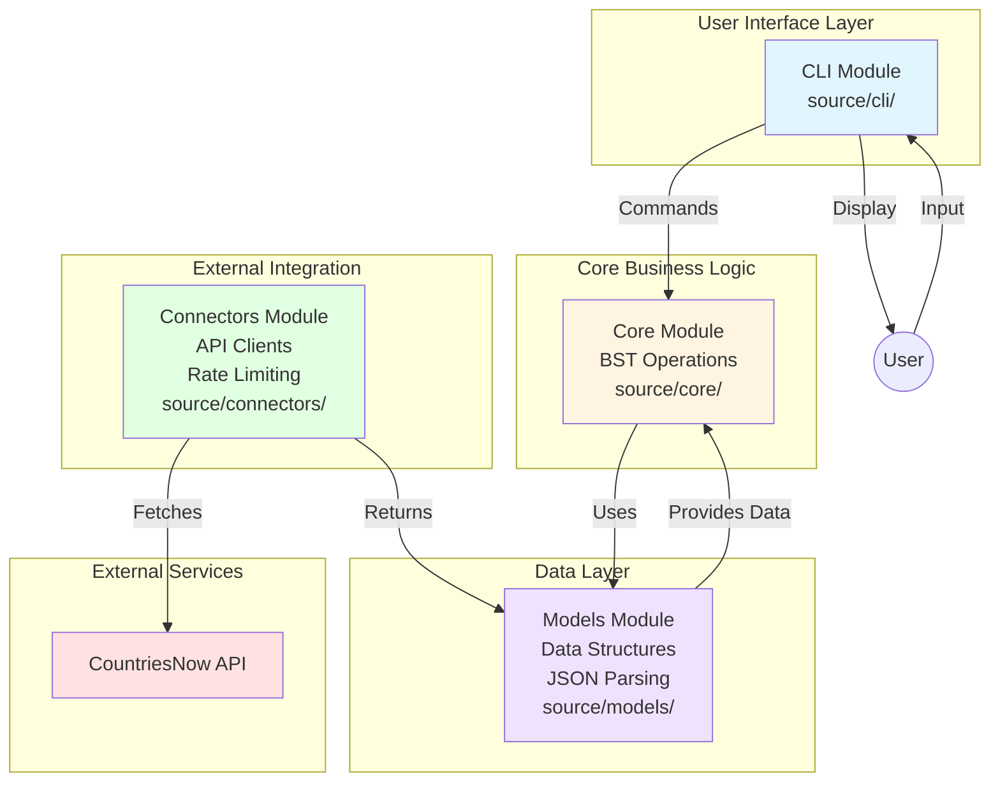

# CitySorter

An interactive command-line that looks up all cities of your favourite countries andand organizes it using a Binary Search Tree (BST) data structure. Depends on public API: [CountriesNow API](https://countriesnow.space/)

## Usage
  - `print` - Display the BST in a rotated format (right → root → left)
  - `add [city]` - Add a new city to the BST
  - `remove [city]` - Remove a city from the BST
  - `stop` - Exit the program

## Requirements
- CMake (version 3.10 or higher)
- GCC compiler
- curl dynamic library for development (for HTTP requests)
- cJSON dynamic library for development (for JSON parsing)
- POSIX-compliant system (Linux/Unix/macOS)

## Installation

```bash
sudo apt update
# development
sudo apt install build-essential cmake libcurl4-openssl-dev libcjson-dev 
# testing 
sudo apt install check pkg-config libsubunit-dev 
# tooling 
sudo apt install codespell clang clang-tidy clang-format libclang-rt-dev lcov cppcheck 
```

## Building

```bash
# Create build directory
mkdir build
cd build

# Configure and build
cmake ..
make citysorter
```

# Run the program
```bash
./citysorter
```

## Testing

The project uses the **Check** testing framework for unit tests and **CTest** for test execution.

### Building and Running Tests

```bash
# Build all tests
cd build
make

# Run all tests via CTest
ctest --output-on-failure

# See unit test cases
ctest --verbose

```

## Project Structure

The project follows a modular architecture with clear separation of concerns:

```
CitySorter/
├── source/              # Source code
│   ├── cli/            # User Interface Layer
│   │   ├── main.c      # CLI implementation
│   │   └── version.h.in # Version header template
│   ├── connectors/     # API Integration Layer
│   │   └── README.md   # Connector documentation
│   ├── models/         # Data Models Layer
│   │   └── README.md   # Model documentation
│   └── core/           # Core Business Logic
│       ├── bst/        # Binary Search Tree module
│       │   ├── include/    # BST public headers
│       │   │   └── bst.h   # BST interface
│       │   ├── source/     # BST implementation
│       │   │   └── bst.c   # BST implementation
│       │   ├── test/       # BST unit tests
│       │   │   └── test_bst.c # Check framework tests (28 tests)
│       │   └── CMakeLists.txt # BST build configuration
│       └── README.md   # Core module documentation
├── tests/              # Integration & E2E tests
│   ├── integration/   # Integration tests
│   ├── e2e/           # End-to-end tests
│   └── README.md      # Test documentation
├── build/             # Build artifacts (generated)
├── CMakeLists.txt     # Root CMake build configuration
└── README.md          # This file
```

### Architecture Layers

1. **CLI Layer** (`source/cli/`): Handles user interaction and input sanitization
2. **Connectors Layer** (`source/connectors/`): Manages external API communication with rate limiting and retry logic
3. **Models Layer** (`source/models/`): Defines data structures and handles JSON parsing/validation
4. **Core Layer** (`source/core/`): Implements core algorithms and business logic (BST operations)

Each layer has its own README with detailed documentation.

### Architecture Diagram



## Implementation Details

### Libraries Used

- **libcurl**: For making HTTP requests to the CountriesNow API
- **cJSON**: For parsing JSON responses and extracting city data
- **Check**: Unit testing framework with excellent isolation and CTest integration
- **Standard C Library**: For memory management, I/O, and string operations

### Data Structure

The program uses a Binary Search Tree (BST) to store city names. Each node contains:
- City name (string)
- Left child pointer
- Right child pointer

Cities are inserted and searched using lexicographic (alphabetical) comparison.

### State Machine

The command processor implements a simple state machine that:
1. Waits for user input
2. Parses the command
3. Executes the corresponding operation
4. Returns to waiting state

## Known Issues & Future Improvements

_This section will be updated as the project develops._

## License

This project is licensed under the MIT License - see the [LICENSE](LICENSE) file for details.

## Author

Felix

## Acknowledgments

- [CountriesNow API](https://countriesnow.space/) for providing the city data
